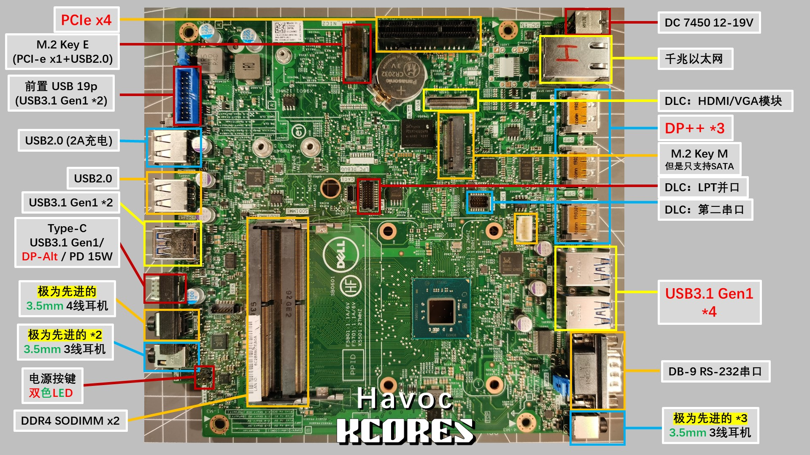

# DELL Wyse 5070 Hacking

关于 DELL Wyse 5070 主板的一些硬件分析和逆向工程

- 介绍视频：[省到离谱，比树莓派还省电的x86主板](https://youtu.be/9opQ4gsh4Hg)

- 交流QQ群：[655944532](https://jq.qq.com/?_wv=1027&k=KV0wy6gJ)

## 主要贡献者

- [@Havoc](https://github.com/Wangrb)
- [@Naivekun](https://github.com/naivekun)
- [@AlphaArea](https://github.com/alphaarea)

## Wyse 5070 基本介绍

Wyse 5070 分为胖瘦两种机型, 主要区别如下

| 瘦机          |   胖机            |
| ------------- | ----------------- |
| PCIe 插槽空焊 | 有 PCIe 插槽      |
| 无风扇        | 有风扇            |
| 检测 90W 电源 | 检测 120W 电源     |

注: 不同批次的主板, 元器件型号可能存在区别

## 刷 BIOS

BIOS 文件在 BIOS 文件夹中, 刷入可以直接解决电源识别问题并提升性能, 但是 DELL 的保护不允许软刷入 BIOS, 必须使用 CH341A 编程器直接刷入 BIOS 芯片.

BIOS 文件由 [@Naivekun](https://github.com/naivekun) 修改, 主要功能:

- 删除电源功率检测, 只要插上电就能用
- 提高 PL1 睿频限制, 性能看齐 J5040
- 提高 CPU 主频 (未生效)

⚠注意: 刷入 BIOS 可能导致主板序列号和集成网卡 MAC 地址改变

## 电源

### 电压范围

实测 Wyse5070 允许 9~20V 范围的宽电压供电, 如果使用电池可以 4S 锂电池直通, 免去稳压提高电池利用率

### 电源识别

建议使用 DELL 供电转接头, 并且最好买标明已刷入 120W 信息的型号, 免得插到胖机主板上识别为供电不足禁止睿频

不建议使用原装 19V 笔记本电源, 因为后续使用 PCIe 转接卡需要 12V 供电

## 开机排线

开机排线必须连接检测针, 否则开机必跳警告

插座型号: 2.0mm 排针

## 喇叭排线

如果不使用声卡也不使用板载喇叭, 可以不管

插座型号: SH1.25

## eMMC

理论上 eMMC 是标准接口全兼容, 但实际上 intel 的 eMMC 一直存在玄学兼容问题, 如需自行安装或扩容建议选择原装同系列的 eMMC

- SKhynix H26M51002KPR
- SanDisk SDINADF4-16G

## PCIe

**⚠警告: 使用 DIY PCIe 转接板必须搭配 12V DC 电源, 使用 19V 笔记本电源将烧毁 PCIe 设备**

1. 胖机可以直接使用转接卡插上 PCIe 设备使用

2. 除非有电动吸锡器等专业工具, 否则不建议用普通装备挑战 DELL 的多层 PCB 过孔灌锡, 很可能彻底损坏 PCIe 插槽焊盘

3. 时钟请求电路见下图  
  

4. 转接卡图纸见 pcie 文件夹, 使用 KiCAD 编辑. 转接板尺寸为自制亚克力外壳设计, 不兼容原厂机箱.

## 散热片

散热片模型见 heatsink 文件夹

## 亚克力外壳

亚克力文件见 case 文件夹

- 上板与主板固定使用 M3x14mm 铜柱
- 下板与主板固定使用 M3x6mm 铜柱

该尺寸为自制 PCIe 转接板设计, 不兼容原厂 PCIe 扩展板

## 开机注意事项

Wyse 5070 的开机逻辑和常见 DIY 主板不同, 它的自检发生在更换硬件后的第一次上电时(无论是否按下开机按钮). 

建议使用可显示电流的稳压电源测试, 自检持续数十秒后电流会降低到 0.1A 以下, 此时自检完成可以按电源键开机.

若自检持续一分钟以上, 且电流不波动, 一般是内存没有装好.
